## About the project 💬

This application was developed to practice object-oriented concepts.

## Features 🔖

- [Main menu](#main-menu)
- [Create account](#create-account)
- [Login account](#login-account)
- [Deposit](#deposit)
- [Withdraw](#withdraw)
- [Bank data](#bank-data)
- [Logout](#logout)

### Main menu

- Follow the instructions to access the desired option.

  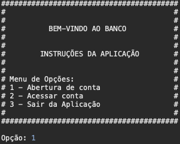

### Create account

- You need to choose which kind of account you prefer to create: Checking (Corrente) or Saving Account (Poupança).

  

- You need to fill this fields out to create a random account.
- The fields are: name (nome), national ID card (RG), tax ID (CPF) , birth date (Data de nascimento) and password (senha).

  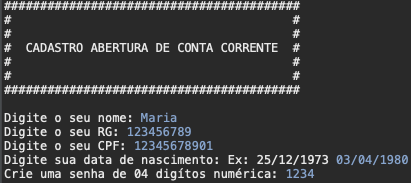

  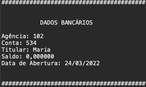

  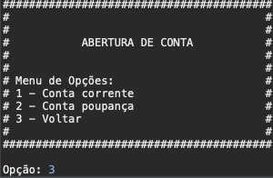

### Login account

- You need to fill this fields out to access your bank account.
- The fields are: bank branch (agência), account number (conta) and password (senha).

  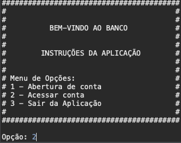

  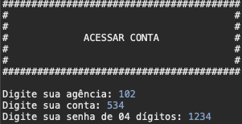

- Then you can deposit and withdraw.

### Deposit

- You need to fill out the amount you want to deposit.

  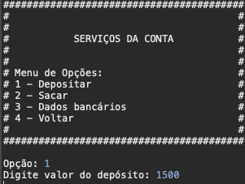

  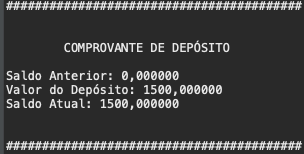

### Withdraw

- You need to fill out the amount you want to withdraw.

  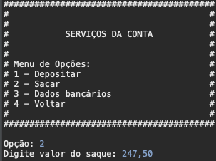

  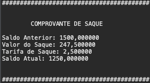

### Bank data

- You can see you bank data.

  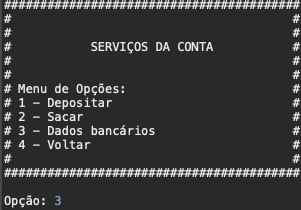

  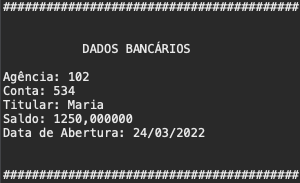

### Logout

- Exit the application

  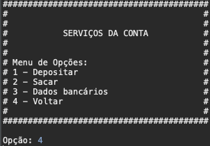

  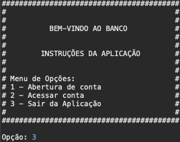

  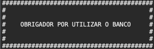

## How to use? 📌

You just need to import this project to your IDE and `Run as Java Application`

## Technologies, Paradigm and Patterns 🛠

Developed using the following technologies, paradigm and patterns:

- Java
- Object-Oriented
- Singleton Pattern

---

Made with ❤️

Julio Zittei 

